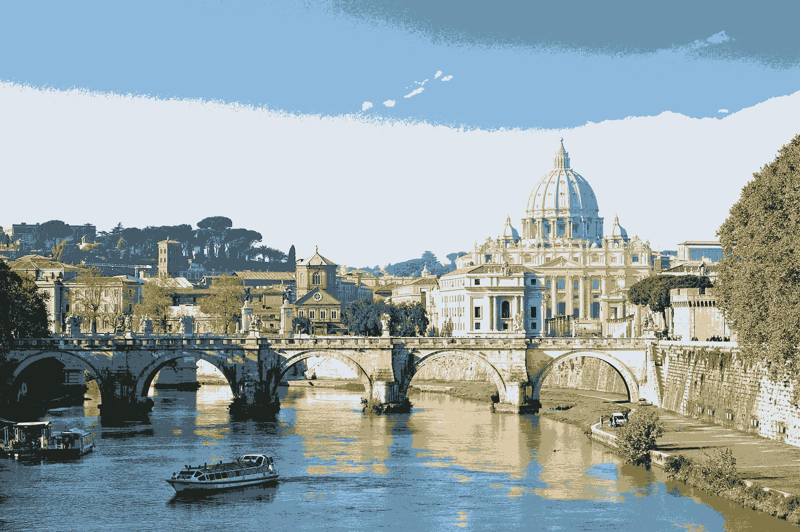

# Image Segmentation
## Scopo del Progetto
Applicare l'algoritmo k-means ai pixel che compongono un'immagine allo scopo di associare ad ogni pixel uno dei k cluster. Il risultato sarà un' immagine composta da k colori. 
## Implementazione
Il progetto è stato implementato tramite il linguaggio Scala avvalendosi del framework Apache Spark. Il file **src/main/scala/Image/ImageSegmentation.scala** si occupa di recuperare i pixel dell'immagine e inserirli in un dataset che ha la seguente struttura:  
| width | height | blue|green|red|
| :---: |:---:| :---: | :---: |:---: |
| 0| 0| 123 |230 |230 |
| 0| 1| 121 |230 |230 |
| 0| 2| ... |... |...|
| ...| ...| ... |... |...|  
  
Prima di essere restituito in output il dataframe viene inserito in una struttura dati denominata VectorAssembler la quale si occupa di inserire le componenti **blue, green, red** in un unico "vettore" che andrà a costituire le features che dovranno essere passate all'algoritmo Kmeans. Sia la struttura dati VectorAssembler che l'algoritmo Kmeans fanno parte della libreria MLib di Apache Spark.  
I file prodotti in output sono:

L'immagine modificata composta da k colori  

Un file in formato **csv** che rappresenta l'immagine con il seguente formato  

| width | height | cluster |
| :---: |:---:| :---: | 
| 0| 0| 1 |
| 0| 1| 2 |
| 0| 2| ...|
| ...| ...|... |  

Un file in formato **csv** che mostra i cluster con il seguente formato:   
| red | green | blue |
| :---: |:---:| :---: | 
| 220| 124| 6 |
| 123| 100| 7 |
| ...| ...|... |  

Un file in formato **csv**  che mostra le dimensioni dell'immagine (come numero di pixel) con il seguente formato:  
| width | height |
| :---: |:---:| 
| 1234| 900|

I file **csv** vengono impiegati dal programma **src/main/util/StampaImmagine.scala** per produrre in output l'immagine. Si è deciso di creare i file csv sebbene l'immagine con i k colori venga già restituita in output in quanto è utile per comprendere il processo di costruzione dell'immagine.  
Il file **project.properties** contiene le seguenti informazioni:  
- Url in cui si trova l'immagine
- numero di cluster
- percorsi in cui verranno salvati i file csv elencati precedentementi
- path dell'immagine in output

## Risulati ottenuti
All'interno della cartella **img** è possibile visionare i risultati ottenuti applicando l'algoritmo all'immagine **img/rome.jpeg**.

|originale|k = 2            |  k = 3 | k = 8|
:---:|:-------------------------:|:------: | :---:|
| |  |  ||

